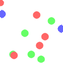
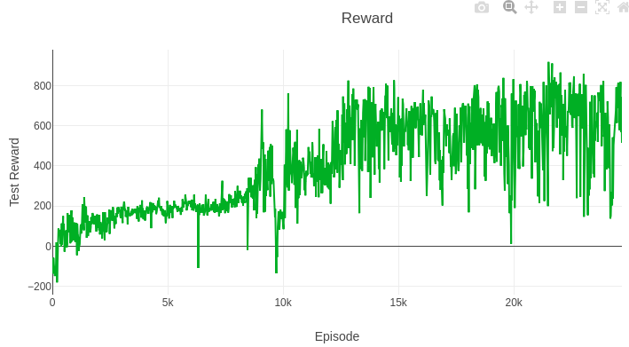
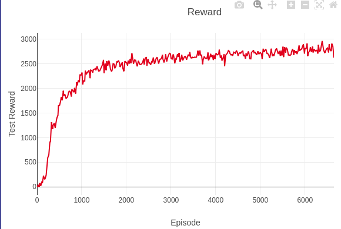

# Continuous control in multi-agent games with MADDPG

[[
Multi-Agent Actor-Critic for Mixed Cooperative-Competitive Environments](https://arxiv.org/abs/1706.02275)]

## WaterWorld

## Multi-Walker

## Requirements:
* [PyTorch](http://pytorch.org/), 0.4.1 (or higher)
* [MADRL](https://github.com/sisl/MADRL)
